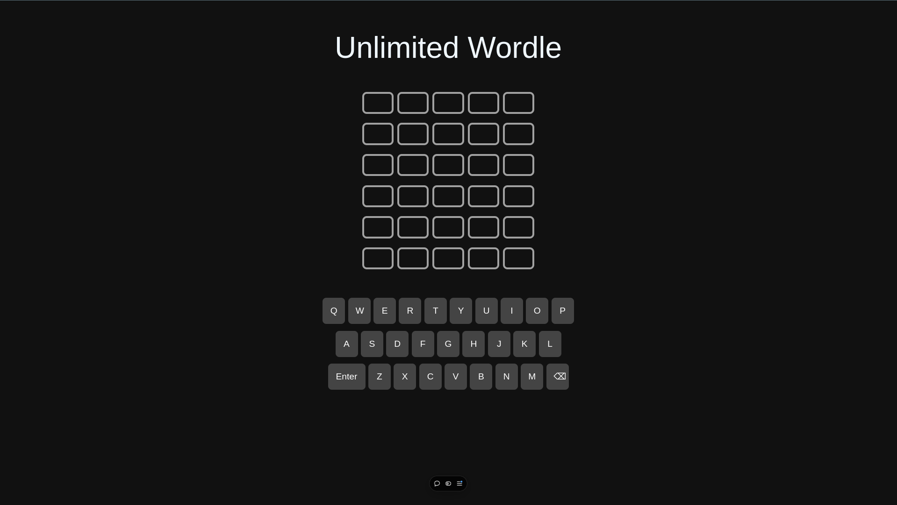
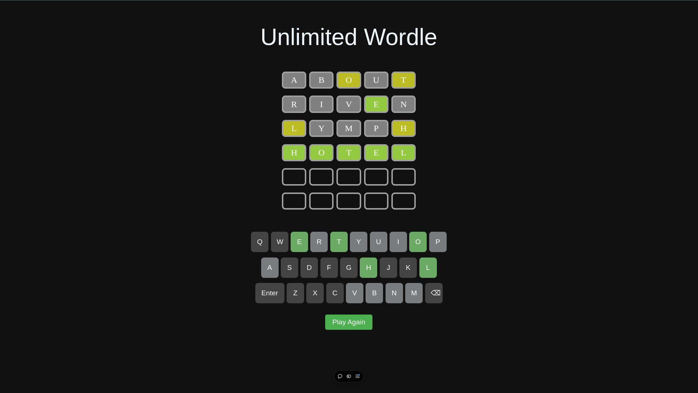

# Unlimited Wordle

## 🎮 **Play Unlimited Wordle Every Day!**

Welcome to **Unlimited Wordle**, a fun and interactive clone of the popular Wordle game, made with **React**. This app allows you to play Wordle without any daily limits, so you can practice your word-guessing skills as much as you want!

---

## 📸 **Features**

- **Unlimited Gameplay**: No more waiting for tomorrow! Play Wordle as many times as you want each day.
- **Real-time Feedback**: Get instant feedback on your guesses with color-coded hints for each letter.
- **Responsive Design**: Enjoy smooth gameplay on any device, from desktop to mobile.
- **Clean UI**: Simple, user-friendly interface to keep the focus on the game.

---

## 🔧 **Technologies Used**

- **React**: The foundation of the app, providing a fast and responsive user interface.
- **CSS**: For styling and creating a visually appealing layout.
- **JavaScript**: To implement game logic and interactions.

---

## 🚀 **How to Run the Project Locally**

To run this project locally, follow the steps below:

1. **Clone the repository**:
   ```bash
   git clone https://github.com/your-username/unlimited-wordle.git
   ```

2. **Navigate to the project directory**:
   ```bash
   cd unlimited-wordle
   ```

3. **Install the dependencies**:
   ```bash
   npm install
   ```

4. **Run the app**:
   ```bash
   npm start
   ```

   This will start the app on [http://localhost:3000](http://localhost:3000).

---

## 💡 **How the Game Works**

1. **Start Guessing**: Type in a 5-letter word and hit Enter.
2. **Feedback**:
   - **Green**: Correct letter in the correct position.
   - **Yellow**: Correct letter, wrong position.
   - **Gray**: Letter is not in the word at all.
3. **Unlimited Plays**: You can keep playing the game without any daily restrictions!

---

## 📷 **Screenshots & Demo**

### Screenshot 1


### Screenshot 2


---
### Watch the Demo Video
[Video Link](https://vimeo.com/1035126956/dd2afd37a4?share=copy)

---
